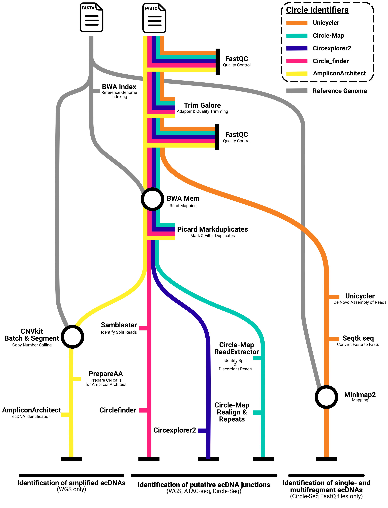

#  

[](https://github.com/nf-core/circdna/actions?query=workflow%3A%22nf-core+CI%22)
[](https://github.com/nf-core/circdna/actions?query=workflow%3A%22nf-core+linting%22)[](https://nf-co.re/circdna/results)[](https://doi.org/10.5281/zenodo.6685250)

[](https://www.nextflow.io/)
[](https://docs.conda.io/en/latest/)
[](https://www.docker.com/)
[](https://sylabs.io/docs/)
[](https://tower.nf/launch?pipeline=https://github.com/nf-core/circdna)

[](https://nfcore.slack.com/channels/circdna) [](https://twitter.com/nf_core) [](https://www.youtube.com/c/nf-core)

## Introduction

**nf-core/circdna** is a bioinformatics best-practice analysis pipeline for the identification of extrachromosomal circular DNAs (ecDNAs) in eukaryotic cells. The pipeline is able to process WGS, ATAC-seq data or Circle-Seq data generated from short-read sequencing technologies. Depending on the input data and selected analysis branch, nf-core/circdna is able to identify various types of ecDNAs. This includes the detection of smaller ecDNAs, often referred to as eccDNAs or microDNAs, as well as larger ecDNAs that exhibit amplification. These analyses are facilitated through the use of prominent software tools that are widely recognized in the field of ecDNA or circular DNA research.

The pipeline is built using [Nextflow](https://www.nextflow.io), a workflow tool to run tasks across multiple compute infrastructures in a very portable manner. It uses Docker/Singularity containers making installation trivial and results highly reproducible. The [Nextflow DSL2](https://www.nextflow.io/docs/latest/dsl2.html) implementation of this pipeline uses one container per process which makes it much easier to maintain and update software dependencies. Where possible, these processes have been submitted to and installed from [nf-core/modules](https://github.com/nf-core/modules) in order to make them available to all nf-core pipelines, and to everyone within the Nextflow community!

On release, automated continuous integration tests run the pipeline on a full-sized dataset on the AWS cloud infrastructure. This ensures that the pipeline runs on AWS, has sensible resource allocation defaults set to run on real-world datasets, and permits the persistent storage of results to benchmark between pipeline releases and other analysis sources.The results obtained from the full-sized test can be viewed on the [nf-core website](https://nf-co.re/circdna/results).

## Pipeline summary

1. Merge re-sequenced FastQ files ([`cat`](http://www.linfo.org/cat.html))
2. Read QC ([`FastQC`](https://www.bioinformatics.babraham.ac.uk/projects/fastqc/))
3. Adapter and quality trimming ([`Trim Galore!`](https://www.bioinformatics.babraham.ac.uk/projects/trim_galore/))
4. Map reads using BWA-MEM ([`BWA`](https://github.com/lh3/bwa))
5. Sort and index alignments ([`SAMtools`](https://sourceforge.net/projects/samtools/files/samtools/))
6. Choice of multiple ecDNA identification routes
   1. [`Circle-Map ReadExtractor`](https://github.com/iprada/Circle-Map) -> [`Circle-Map Realign`](https://github.com/iprada/Circle-Map)
   1. [`Circle-Map ReadExtractor`](https://github.com/iprada/Circle-Map) -> [`Circle-Map Repeats`](https://github.com/iprada/Circle-Map)
   1. [`CIRCexplorer2`](https://circexplorer2.readthedocs.io/en/latest/)
   1. [`Samblaster`](https://github.com/GregoryFaust/samblaster) -> [`Circle_finder`](https://github.com/pk7zuva/Circle_finder) **Does not use filtered BAM file, specificied with --keep_duplicates false**
   1. Identification of circular amplicons [`AmpliconArchitect`](https://github.com/jluebeck/AmpliconArchitect)
   1. De Novo Assembly of ecDNAs [`Unicycler`](https://github.com/rrwick/Unicycler) -> [`Minimap2`](https://github.com/lh3/minimap2)
7. Present QC for raw reads ([`MultiQC`](http://multiqc.info/))

## Functionality Overview

A graphical view of the pipeline and its diverse branches can be seen below.

<p align="center">

</p>

## Usage

> [!NOTE]
> If you are new to Nextflow and nf-core, please refer to [this page](https://nf-co.re/docs/usage/installation) on how to set-up Nextflow. Make sure to [test your setup](https://nf-co.re/docs/usage/introduction#how-to-run-a-pipeline) with `-profile test` before running the workflow on actual data.

First, prepare a samplesheet with your input data that looks as follows:

`samplesheet.csv`:

`FASTQ` input data:

```csv
sample,fastq_1,fastq_2
CONTROL_REP1,AEG588A1_S1_L002_R1_001.fastq.gz,AEG588A1_S1_L002_R2_001.fastq.gz
```

`BAM` input data:

```csv
sample,bam
CONTROL_REP1,AEG588A1_S1_L002_R1_001.bam
```

Each row represents a pair of fastq files (paired end) or a single bam file generated from paired-end reads.

Now, you can run the pipeline using:

```bash
   nextflow run nf-core/circdna --input samplesheet.csv --outdir <OUTDIR> --genome GRCh38 -profile <docker/singularity/podman/shifter/charliecloud/conda/institute> --circle_identifier <CIRCLE_IDENTIFIER>
```

## Available ecDNA identifiers

Please specify the parameter `circle_identifier` depending on the pipeline branch used for circular DNA identifaction. Please note that some branches/software are only tested with specific NGS data sets.

### Identification of putative ecDNA junctions with ATAC-seq or Circle-seq data

> `circle_finder` uses [Circle_finder](https://github.com/pk7zuva/Circle_finder) > `circexplorer2` uses [CIRCexplorer2](https://circexplorer2.readthedocs.io/en/latest/) > `circle_map_realign` uses [Circle-Map Realign](https://github.com/iprada/Circle-Map) > `circle_map_repeats` uses [Circle-Map Repeats](https://github.com/iprada/Circle-Map) for the identification of repetetive ecDNA

### Identification of amplified ecDNAs with WGS data

> `ampliconarchitect` uses [AmpliconArchitect](https://github.com/jluebeck/AmpliconArchitect)

### De novo assembly of ecDNAs with Circle-seq data

> `unicycler` uses [Unicycler](https://github.com/rrwick/Unicycler) for de novo assembly of ecDNAs and [Minimap2](https://github.com/lh3/minimap2) for accurate mapping of the identified circular sequences.

> [!WARNING]
> Please provide pipeline parameters via the CLI or Nextflow `-params-file` option. Custom config files including those provided by the `-c` Nextflow option can be used to provide any configuration _**except for parameters**_;
> see [docs](https://nf-co.re/usage/configuration#custom-configuration-files).

For more details and further functionality, please refer to the [usage documentation](https://nf-co.re/circdna/usage) and the [parameter documentation](https://nf-co.re/circdna/parameters).

## Pipeline output

To see the results of an example test run with a full size dataset refer to the [results](https://nf-co.re/circdna/results) tab on the nf-core website pipeline page.
For more details about the output files and reports, please refer to the
[output documentation](https://nf-co.re/circdna/output).

## Credits

nf-core/circdna was originally written by [Daniel Schreyer](https://github.com/DSchreyer), University of Glasgow, Institute of Cancer Sciences, Peter Bailey Lab.

We thank the following people for their extensive assistance in the development of this pipeline:

- Sébastian Guizard: Review and Discussion of Pipeline
- Alex Peltzer: Code Review
- Phil Ewels: Help in setting up the pipeline repository and directing the pipeline development
- nf-core community: Answering all nextflow and nf-core related questions
- Peter Bailey: Discussion of Software and Pipeline Architecture

This pipeline has been developed by Daniel Schreyer as part of the PRECODE project. PRECODE received funding from the European Union’s Horizon 2020 Research and Innovation Program under the Marie Skłodowska-Curie grant agreement No 861196.

## Contributions and Support

If you would like to contribute to this pipeline, please see the [contributing guidelines](.github/CONTRIBUTING.md).

For further information or help, don't hesitate to get in touch on the [Slack `#circdna` channel](https://nfcore.slack.com/channels/circdna) (you can join with [this invite](https://nf-co.re/join/slack)).

## Citations

If you use nf-core/circdna for your analysis, please cite it using the following doi: [10.5281/zenodo.6685250](https://doi.org/10.5281/zenodo.6685250)

An extensive list of references for the tools used by the pipeline can be found in the [`CITATIONS.md`](CITATIONS.md) file.

You can cite the `nf-core` publication as follows:

> **The nf-core framework for community-curated bioinformatics pipelines.**
>
> Philip Ewels, Alexander Peltzer, Sven Fillinger, Harshil Patel, Johannes Alneberg, Andreas Wilm, Maxime Ulysse Garcia, Paolo Di Tommaso & Sven Nahnsen.
>
> _Nat Biotechnol._ 2020 Feb 13. doi: [10.1038/s41587-020-0439-x](https://dx.doi.org/10.1038/s41587-020-0439-x).
